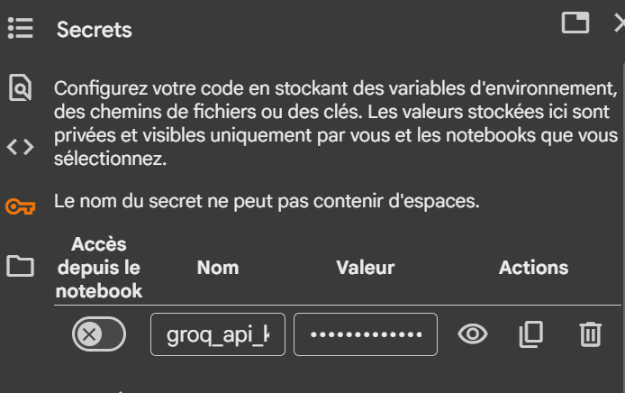

**LangGraph** is a library for building stateful, multi-actor applications with LLMs, used to create agent and multi- agent workflows. Compared to other LLM frameworks, it offers these core benefits: cycles, controllability, and persistence. LangGraph allows you to define flows that involve cycles, essential for most agentic architectures, differentiating it from DAG-based solutions.
Agenda
1) What is langraph?
2) Why Langraph?
- simplifies developement : agent coordination
- flexibility : specified use cases
- scalability : interaction and complex workflows 
- fault tolerance : 
  3) Getting Started with langraph
langra and it you can do it completely in a visualization way right and right

pour les modeles on va utiliser https://groq.com/ pour recuperer key et utiliser les modeles mais avec limit de qota

recuperer aussi de https://smith.langchain.com/o/f140c30e-88bd-4e41-a028-01ea1cf1c62d/settings/apikeys votre lansmith key